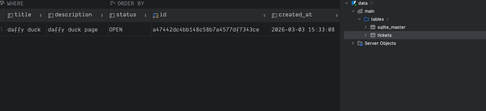

# 🎫 Tickets Management API


Une API REST de gestion de tickets construite avec FastAPI, SQLAlchemy et SQLite.

## 📋 Fonctionnalités

- [x] Créer, lister, récupérer et modifier des tickets
- [x] Fermer un ticket via un endpoint dédié
- [x] Validation des données avec Pydantic
- [x] Documentation Swagger auto-générée
- [x] Tests avec couverture ≥ 80%
- [x] Linting avec Ruff et typage strict avec Mypy
- [x] Docker & Makefile inclus

## Stack

| Outil           | Usage                       |
|-----------------|-----------------------------|
| Python 3.12     | Langage                     |
| FastAPI         | Framework web               |
| SQLAlchemy      | ORM / Core                  |
| SQLite          | Base de données             |
| Pydantic        | Validation                  |
| Pytest + AnyIO  | Tests                       |
| Ruff            | Linting & formatting        |
| Mypy            | Typage statique             |
| uv              | Gestionnaire de dépendances |
| pre-commit hook | pre commit                  |
| Docker          | Conteneurisation            |

## 📁 Structure du projet

```
app/
├── config/
│   ├── database.py         # Connexion DB, table SQLAlchemy
│   ├── logging.py          # Configuration du logging
│   └── settings.py         # Configuration par environnement (Dev / Test / Prod)
├── exceptions/
│   ├── business.py         # Exceptions métier
│   └── http.py             # Gestionnaire d'exceptions HTTP
├── middlewares/
│   └── logs.py             # Middleware de logging des requêtes
├── mixins/
│   └── common.py           # Mixins partagés (UUID, Timestamp)
├── models/
│   └── ticket.py           # Modèle SQLAlchemy
├── routes/
│   └── ticket.py           # Endpoints FastAPI
├── schemas/
│   └── ticket.py           # Schémas Pydantic
├── services/
│   └── ticket.py           # Logique métier
├── tests/
│   ├── api/                # Tests des endpoints
│   ├── services/           # Tests des services
│   └── conftest.py         # Fixtures Pytest
├── enums.py                # TicketStatus enum
└── main.py                 # Point d'entrée FastAPI
```

## Lancer le projet

### Prérequis

- [uv](https://docs.astral.sh/uv/) installé
- Python 3.12+

### Clone the project

```shell
git clone https://github.com/chkechad/tickets_management
```

### Installation

```shell
uv sync
```

### Créer un fichier .env à la racine

```shell
ENV_STATE=dev
DEV_DATABASE_URL=sqlite:///dev.db
```

### Lancer l'api

```shell
uv run uvicorn app.main:app --host 0.0.0.0 --port 8000 --reload
```

### Lancer ls tests

```shell
uv run pytest
```

### Avec docker

```shell
docker compose up --build
```

### Avec Makefile
#### Lancer le projet avec docker:
```shell
make init
make env
make up
```

## 📖 Documentation

```
http://localhost:8000/docs      # Swagger
http://localhost:8000/redoc     # ReDoc
```

## 🔌 Endpoints

| Méthode | URL                          | Description             |
|---------|------------------------------|-------------------------|
| `POST`  | `/tickets`                   | Créer un ticket         |
| `GET`   | `/tickets`                   | Lister tous les tickets |
| `GET`   | `/tickets/{ticket_id}`       | Récupérer un ticket     |
| `PUT`   | `/tickets/{ticket_id}`       | Modifier un ticket      |
| `PATCH` | `/tickets/{ticket_id}/close` | Fermer un ticket        |

### Exemple de création

```shell
curl -X POST http://localhost:8000/tickets \
  -H "Content-Type: application/json" \
  -d '{"title": "daffy duck", "description": "daffy duck page"}'
```

### Curl


### Sqlite DB



## 🧪 Tests

```shell
uv run pytest

# Avec couverture
uv run pytest --cov=app --cov-report=term-missing
```

## 🔍 Linting & typage

```shell
uv run ruff check .
uv run ruff format .
uv run mypy app/
```

## 🛠️ Makefile

| Commande               | Description                                       |
|------------------------|---------------------------------------------------|
| `make install`         | Installe les dépendances et pre-commit            |
| `make init`            | Initialisation complète du projet                 |
| `make env`             | Génère le `.env` depuis `.env.example`            |
| `make up`              | Lance les services Docker                         |
| `make down`            | Arrête les services Docker                        |
| `make logs`            | Suit les logs de l'app                            |
| `make ps`              | Affiche les services en cours                     |
| `make restart`         | Redémarre l'app                                   |
| `make lint`            | Ruff check + format                               |
| `make typecheck`       | Mypy                                              |
| `make test`            | Pytest + couverture                               |
| `make coverage`        | Rapport HTML de couverture                        |
| `make docker-test`     | Pytest in docker                                  |
| `make docker-test-cov` | Pytest in docker avec couverture de code          |
| `make bandit`          | Analyse de sécurité du code                       |
| `make security`        | Audit des dépendances                             |
| `make check`           | Pipeline complet (lint + type + sécurité + tests) |
| `make clean`           | Nettoie les fichiers temporaires                  |

### Commandes essentielles

```bash
# Première installation
make init

# Lancer en local avec Docker
make up

# Avant chaque commit
make check

# lancer les tests
make test
```

## 🌍 Environnements

| Variable            | Description                 |
|---------------------|-----------------------------|
| `ENV_STATE`         | `dev`, `prod` ou `test`     |
| `DEV_DATABASE_URL`  | URL base de données en dev  |
| `PROD_DATABASE_URL` | URL base de données en prod |
